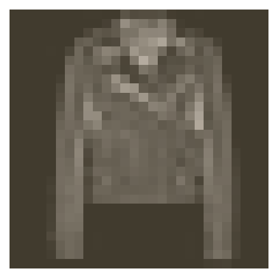

# Saving and Loading Models

In this notebook, I'll show you how to save and load models with PyTorch. This is important because you'll often want to load previously trained models to use in making predictions or to continue training on new data.


```python
%matplotlib inline
%config InlineBackend.figure_format = 'retina'

import matplotlib.pyplot as plt

import torch
from torch import nn
from torch import optim
import torch.nn.functional as F
from torchvision import datasets, transforms

import helper
import fc_model
```


```python
# Define a transform to normalize the data
transform = transforms.Compose([transforms.ToTensor(),
                                transforms.Normalize((0.5,), (0.5,))])
# Download and load the training data
trainset = datasets.FashionMNIST('F_MNIST_data/', download=True, train=True, transform=transform)
trainloader = torch.utils.data.DataLoader(trainset, batch_size=64, shuffle=True)

# Download and load the test data
testset = datasets.FashionMNIST('F_MNIST_data/', download=True, train=False, transform=transform)
testloader = torch.utils.data.DataLoader(testset, batch_size=64, shuffle=True)
```

    Downloading http://fashion-mnist.s3-website.eu-central-1.amazonaws.com/train-images-idx3-ubyte.gz
    Downloading http://fashion-mnist.s3-website.eu-central-1.amazonaws.com/train-labels-idx1-ubyte.gz
    Downloading http://fashion-mnist.s3-website.eu-central-1.amazonaws.com/t10k-images-idx3-ubyte.gz
    Downloading http://fashion-mnist.s3-website.eu-central-1.amazonaws.com/t10k-labels-idx1-ubyte.gz
    Processing...
    Done!


Here we can see one of the images.


```python
image, label = next(iter(trainloader))
helper.imshow(image[0,:]);
```





# Train a network

To make things more concise here, I moved the model architecture and training code from the last part to a file called `fc_model`. Importing this, we can easily create a fully-connected network with `fc_model.Network`, and train the network using `fc_model.train`. I'll use this model (once it's trained) to demonstrate how we can save and load models.


```python
# Create the network, define the criterion and optimizer

model = fc_model.Network(784, 10, [512, 256, 128])
criterion = nn.NLLLoss()
optimizer = optim.Adam(model.parameters(), lr=0.001)
```


```python
fc_model.train(model, trainloader, testloader, criterion, optimizer, epochs=2)
```

    Epoch: 1/2..  Training Loss: 1.616..  Test Loss: 0.974..  Test Accuracy: 0.668
    Epoch: 1/2..  Training Loss: 1.069..  Test Loss: 0.743..  Test Accuracy: 0.734
    Epoch: 1/2..  Training Loss: 0.862..  Test Loss: 0.688..  Test Accuracy: 0.743
    Epoch: 1/2..  Training Loss: 0.780..  Test Loss: 0.638..  Test Accuracy: 0.754
    Epoch: 1/2..  Training Loss: 0.767..  Test Loss: 0.625..  Test Accuracy: 0.759
    Epoch: 1/2..  Training Loss: 0.690..  Test Loss: 0.610..  Test Accuracy: 0.775
    Epoch: 1/2..  Training Loss: 0.719..  Test Loss: 0.575..  Test Accuracy: 0.781
    Epoch: 1/2..  Training Loss: 0.664..  Test Loss: 0.572..  Test Accuracy: 0.792
    Epoch: 1/2..  Training Loss: 0.713..  Test Loss: 0.598..  Test Accuracy: 0.779
    Epoch: 1/2..  Training Loss: 0.651..  Test Loss: 0.552..  Test Accuracy: 0.785
    Epoch: 1/2..  Training Loss: 0.627..  Test Loss: 0.597..  Test Accuracy: 0.786
    Epoch: 1/2..  Training Loss: 0.651..  Test Loss: 0.544..  Test Accuracy: 0.800
    Epoch: 1/2..  Training Loss: 0.610..  Test Loss: 0.523..  Test Accuracy: 0.807
    Epoch: 1/2..  Training Loss: 0.603..  Test Loss: 0.519..  Test Accuracy: 0.809
    Epoch: 1/2..  Training Loss: 0.609..  Test Loss: 0.513..  Test Accuracy: 0.811
    Epoch: 1/2..  Training Loss: 0.574..  Test Loss: 0.503..  Test Accuracy: 0.819
    Epoch: 1/2..  Training Loss: 0.596..  Test Loss: 0.510..  Test Accuracy: 0.810
    Epoch: 1/2..  Training Loss: 0.631..  Test Loss: 0.504..  Test Accuracy: 0.810
    Epoch: 1/2..  Training Loss: 0.587..  Test Loss: 0.487..  Test Accuracy: 0.823
    Epoch: 1/2..  Training Loss: 0.573..  Test Loss: 0.485..  Test Accuracy: 0.821
    Epoch: 1/2..  Training Loss: 0.590..  Test Loss: 0.499..  Test Accuracy: 0.816
    Epoch: 1/2..  Training Loss: 0.548..  Test Loss: 0.489..  Test Accuracy: 0.823
    Epoch: 1/2..  Training Loss: 0.586..  Test Loss: 0.491..  Test Accuracy: 0.822
    Epoch: 2/2..  Training Loss: 0.554..  Test Loss: 0.497..  Test Accuracy: 0.825
    Epoch: 2/2..  Training Loss: 0.553..  Test Loss: 0.491..  Test Accuracy: 0.819
    Epoch: 2/2..  Training Loss: 0.514..  Test Loss: 0.464..  Test Accuracy: 0.829
    Epoch: 2/2..  Training Loss: 0.511..  Test Loss: 0.486..  Test Accuracy: 0.825
    Epoch: 2/2..  Training Loss: 0.552..  Test Loss: 0.475..  Test Accuracy: 0.829
    Epoch: 2/2..  Training Loss: 0.578..  Test Loss: 0.485..  Test Accuracy: 0.826
    Epoch: 2/2..  Training Loss: 0.550..  Test Loss: 0.515..  Test Accuracy: 0.816
    Epoch: 2/2..  Training Loss: 0.554..  Test Loss: 0.463..  Test Accuracy: 0.833
    Epoch: 2/2..  Training Loss: 0.516..  Test Loss: 0.470..  Test Accuracy: 0.829
    Epoch: 2/2..  Training Loss: 0.544..  Test Loss: 0.452..  Test Accuracy: 0.834
    Epoch: 2/2..  Training Loss: 0.530..  Test Loss: 0.458..  Test Accuracy: 0.837
    Epoch: 2/2..  Training Loss: 0.563..  Test Loss: 0.465..  Test Accuracy: 0.822
    Epoch: 2/2..  Training Loss: 0.529..  Test Loss: 0.449..  Test Accuracy: 0.834
    Epoch: 2/2..  Training Loss: 0.530..  Test Loss: 0.458..  Test Accuracy: 0.834
    Epoch: 2/2..  Training Loss: 0.500..  Test Loss: 0.461..  Test Accuracy: 0.827
    Epoch: 2/2..  Training Loss: 0.572..  Test Loss: 0.465..  Test Accuracy: 0.829
    Epoch: 2/2..  Training Loss: 0.476..  Test Loss: 0.467..  Test Accuracy: 0.829
    Epoch: 2/2..  Training Loss: 0.547..  Test Loss: 0.462..  Test Accuracy: 0.823
    Epoch: 2/2..  Training Loss: 0.534..  Test Loss: 0.467..  Test Accuracy: 0.834
    Epoch: 2/2..  Training Loss: 0.476..  Test Loss: 0.444..  Test Accuracy: 0.840
    Epoch: 2/2..  Training Loss: 0.547..  Test Loss: 0.450..  Test Accuracy: 0.840
    Epoch: 2/2..  Training Loss: 0.543..  Test Loss: 0.435..  Test Accuracy: 0.844
    Epoch: 2/2..  Training Loss: 0.546..  Test Loss: 0.435..  Test Accuracy: 0.840


## Saving and loading networks

As you can imagine, it's impractical to train a network every time you need to use it. Instead, we can save trained networks then load them later to train more or use them for predictions.

The parameters for PyTorch networks are stored in a model's `state_dict`. We can see the state dict contains the weight and bias matrices for each of our layers.


```python
print("Our model: \n\n", model, '\n')
print("The state dict keys: \n\n", model.state_dict().keys())
```

    Our model: 
    
     Network(
      (hidden_layers): ModuleList(
        (0): Linear(in_features=784, out_features=512, bias=True)
        (1): Linear(in_features=512, out_features=256, bias=True)
        (2): Linear(in_features=256, out_features=128, bias=True)
      )
      (output): Linear(in_features=128, out_features=10, bias=True)
      (dropout): Dropout(p=0.5)
    ) 
    
    The state dict keys: 
    
     odict_keys(['hidden_layers.0.weight', 'hidden_layers.0.bias', 'hidden_layers.1.weight', 'hidden_layers.1.bias', 'hidden_layers.2.weight', 'hidden_layers.2.bias', 'output.weight', 'output.bias'])


The simplest thing to do is simply save the state dict with `torch.save`. For example, we can save it to a file `'checkpoint.pth'`.


```python
torch.save(model.state_dict(), 'checkpoint.pth')
```

Then we can load the state dict with `torch.load`.


```python
state_dict = torch.load('checkpoint.pth')
print(state_dict.keys())
```

    odict_keys(['hidden_layers.0.weight', 'hidden_layers.0.bias', 'hidden_layers.1.weight', 'hidden_layers.1.bias', 'hidden_layers.2.weight', 'hidden_layers.2.bias', 'output.weight', 'output.bias'])


And to load the state dict in to the network, you do `model.load_state_dict(state_dict)`.


```python
model.load_state_dict(state_dict)
```

Seems pretty straightforward, but as usual it's a bit more complicated. Loading the state dict works only if the model architecture is exactly the same as the checkpoint architecture. If I create a model with a different architecture, this fails.


```python
# Try this
model = fc_model.Network(784, 10, [400, 200, 100])
# This will throw an error because the tensor sizes are wrong!
model.load_state_dict(state_dict)
```


    ----------------------------------------------------------------------

    RuntimeError                         Traceback (most recent call last)

    <ipython-input-10-d859c59ebec0> in <module>()
          2 model = fc_model.Network(784, 10, [400, 200, 100])
          3 # This will throw an error because the tensor sizes are wrong!
    ----> 4 model.load_state_dict(state_dict)
    

    /usr/local/lib/python3.7/site-packages/torch/nn/modules/module.py in load_state_dict(self, state_dict, strict)
        717         if len(error_msgs) > 0:
        718             raise RuntimeError('Error(s) in loading state_dict for {}:\n\t{}'.format(
    --> 719                                self.__class__.__name__, "\n\t".join(error_msgs)))
        720 
        721     def parameters(self):


    RuntimeError: Error(s) in loading state_dict for Network:
    	size mismatch for hidden_layers.0.weight: copying a param of torch.Size([400, 784]) from checkpoint, where the shape is torch.Size([512, 784]) in current model.
    	size mismatch for hidden_layers.0.bias: copying a param of torch.Size([400]) from checkpoint, where the shape is torch.Size([512]) in current model.
    	size mismatch for hidden_layers.1.weight: copying a param of torch.Size([200, 400]) from checkpoint, where the shape is torch.Size([256, 512]) in current model.
    	size mismatch for hidden_layers.1.bias: copying a param of torch.Size([200]) from checkpoint, where the shape is torch.Size([256]) in current model.
    	size mismatch for hidden_layers.2.weight: copying a param of torch.Size([100, 200]) from checkpoint, where the shape is torch.Size([128, 256]) in current model.
    	size mismatch for hidden_layers.2.bias: copying a param of torch.Size([100]) from checkpoint, where the shape is torch.Size([128]) in current model.
    	size mismatch for output.weight: copying a param of torch.Size([10, 100]) from checkpoint, where the shape is torch.Size([10, 128]) in current model.


This means we need to rebuild the model exactly as it was when trained. Information about the model architecture needs to be saved in the checkpoint, along with the state dict. To do this, you build a dictionary with all the information you need to compeletely rebuild the model.


```python
checkpoint = {'input_size': 784,
              'output_size': 10,
              'hidden_layers': [each.out_features for each in model.hidden_layers],
              'state_dict': model.state_dict()}

torch.save(checkpoint, 'checkpoint.pth')
```

Now the checkpoint has all the necessary information to rebuild the trained model. You can easily make that a function if you want. Similarly, we can write a function to load checkpoints. 


```python
def load_checkpoint(filepath):
    checkpoint = torch.load(filepath)
    model = fc_model.Network(checkpoint['input_size'],
                             checkpoint['output_size'],
                             checkpoint['hidden_layers'])
    model.load_state_dict(checkpoint['state_dict'])
    
    return model
```


```python
model = load_checkpoint('checkpoint.pth')
print(model)
```

    Network(
      (hidden_layers): ModuleList(
        (0): Linear(in_features=784, out_features=400, bias=True)
        (1): Linear(in_features=400, out_features=200, bias=True)
        (2): Linear(in_features=200, out_features=100, bias=True)
      )
      (output): Linear(in_features=100, out_features=10, bias=True)
      (dropout): Dropout(p=0.5)
    )

